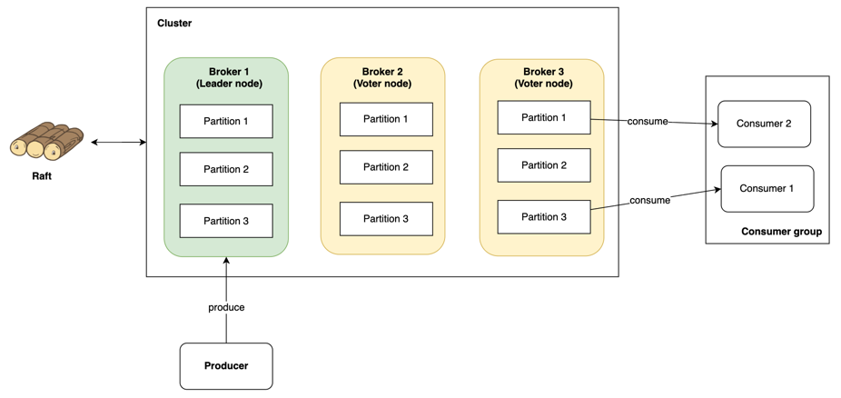

# Go-Kafka: A Distributed, Fault-Tolerant Message Queue from Scratch
Go-Kafka is a from-scratch implementation of a distributed, replicated message queue inspired by Apache Kafka. This project is a deep dive into the core principles of distributed systems, demonstrating concepts like distributed consensus, replication, fault tolerance, and high-performance storage techniques, all built in pure Go.

It is not intended to be a production-ready replacement for Kafka, but rather a powerful demonstration of the engineering principles required to build such a system.

## Core Features
- **Replicated, Append-Only Commit Log**: At its heart is a durable, high-performance storage engine that writes messages to an immutable, append-only log file on disk. This log is the source of truth for all data.

- **Topics & Partitions**: The system supports organizing data into topics, which are subdivided into partitions. This allows for data isolation, multi-tenancy, and serves as the fundamental unit of parallelism for consumers.

- **Distributed Consensus with Raft**: The cluster uses the industry-standard Raft consensus algorithm (via hashicorp/raft) to ensure all brokers agree on the state of the data. This provides:

  - **Automatic Leader Election**: For each partition, one broker is elected leader to handle all writes.

  - **Log Replication**: The leader replicates all messages to follower nodes.

  - **Fault Tolerance**: The cluster can survive the failure of a minority of nodes without downtime or data loss. A new leader is automatically elected if the current one fails.

- **Cluster-Aware Client**: The client is designed to interact with a dynamic cluster. It features:

  - **Automatic Leader Discovery**: A client can connect to any node. If it contacts a follower, it will be automatically redirected to the correct leader.

- **Durable Consumer Offsets**: The broker tracks the progress of each consumer group, persisting their offsets to a file. This provides at-least-once message delivery guarantees, as a consumer can crash and restart without losing its place.

- **Configurable Producer Acknowledgements (acks)**: Producers can choose their desired level of durability on a per-message basis, demonstrating the classic trade-off between latency and safety:

  - `ack=all` (Default): The producer waits for the message to be durably replicated to a quorum of nodes. (Maximum safety)

  - `ack=none`: The producer sends the message and does not wait for a response. (Lowest latency)
- **Dynamic Consumer Group Rebalancing**: A full implementation of the Kafka-style consumer group protocol.

  - Fault Tolerance: Automatically detects consumer failures via heartbeating and reassigns their partitions to the remaining live members.

  - Scalability: Automatically balances partitions across all consumers in a group as they join and leave.
# Architecture
## Overview


## Commit log file structure


## Raft instance


## Partition Rebalancing Protocol


# Getting Started
## Prerequisites
- Go 1.18+
- Protocol Buffers Compiler (protoc) and the Go gRPC plugins.

```bash
# Install Homebrew
/bin/bash -c "$(curl -fsSL https://raw.githubusercontent.com/Homebrew/install/HEAD/install.sh)"
# Install protobuf
brew install protobuf
# Install the Go Plugins
go install google.golang.org/protobuf/cmd/protoc-gen-go@latest
go install google.golang.org/grpc/cmd/protoc-gen-go-grpc@latest
# Update your path
export PATH="$PATH:$(go env GOPATH)/bin"
```

## 1. Clear data
```bash
rm -rf ./data
```
## 2. Launch the Cluster
Run these commands in three separate terminals.

### Terminal 1: Start Node 1 (Initial Leader)
```bash
go run broker/main.go -id=node1 -grpc_addr=127.0.0.1:9092 -raft_addr=127.0.0.1:19092
```

### Terminal 2: Start Node 2
```bash
go run broker/main.go -id=node2 -grpc_addr=127.0.0.1:9093 -raft_addr=127.0.0.1:19093 -join_addr=127.0.0.1:9092
```
### Terminal 3: Start Node 3
```bash
go run broker/main.go -id=node3 -grpc_addr=127.0.0.1:9094 -raft_addr=127.0.0.1:19094 -join_addr=127.0.0.1:9093
```

Wait 5 seconds for the cluster to stabilize.

## 3. Using the client
### A. Create a Topic
```bash
go run client/main.go create-topic --bootstrap-server <addr> --topic <name> --partitions <num>
```

e.g.
```bash
go run client/main.go create-topic --bootstrap-server 127.0.0.1:9092 --topic replicated-topic --partitions 4
```
### B. Produce a message (terminal 4)
```bash
go run client/main.go produce --bootstrap-server <addr> --topic <topic> <partition> <value>
```
e.g.
```bash
go run client/main.go produce --bootstrap-server=127.0.0.1:9092 --topic=replicated-topic 0 "first message"
```

### C. Consume Messages
```bash
go run client/main.go consume --bootstrap-server <addr> --topic <topic> --group <group_id>
```

e.g.
```bash
go run client/main.go consume --bootstrap-server 127.0.0.1:9092 --topic replicated-topic --group logging-group
```
# Testing Fault Tolerance
1. Start 3-node cluster and create a topic
2. Start a producer and send a message.
3. Stop leader node (Ctrl+C in its terminal)
4. Observe the logs of the other two nodes. A new leader will be elected within seconds.
5. Run the exact same produce command again.
The client will automatically discover the new leader and successfully send the message, demonstrating the system's high availability.
6. Restart node 1 (previous leader that was stopped in step 3)
7. Produce a message to node 1.
8. Observe client was redirected to new leader and message was replicated to all 3 nodes. 
# Future Work
- [ ] Group Coordinator
- [ ] Time-Based Log Retention
- [ ] Administrative APIs
- [ ] Exactly once Semantic
  - [ ] Idempotent Producer
  - [ ] Read-Process-Commit Transaction
# License
This project is licensed under the MIT License.